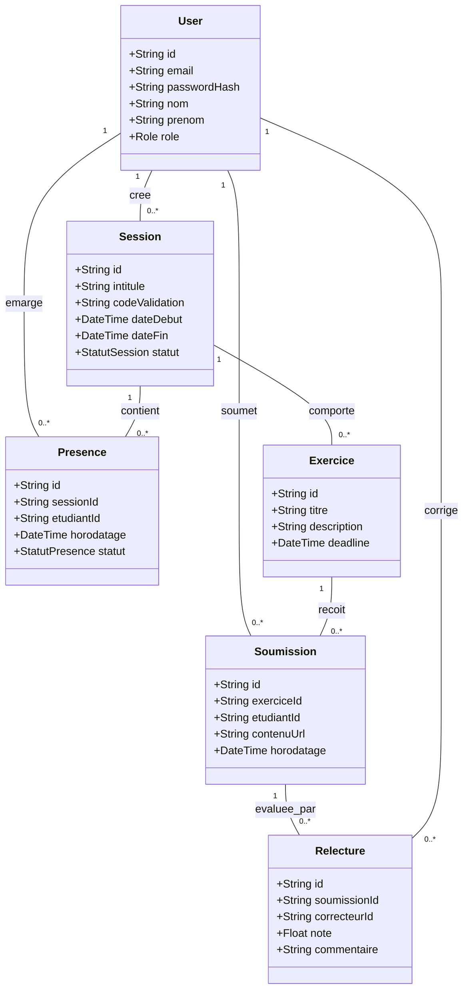
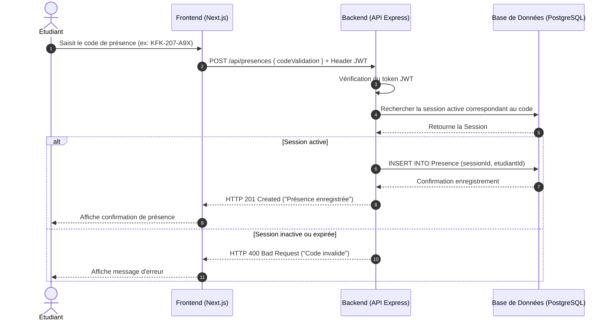

# Conception & Architecture Technique — KFOKAM48

* **Projet** : Système de Suivi des Présences et Évaluations (KFOKAM48)
* **Auteur / Matricule** : 207
* **Date** : 25 Septembre 2026

---

## 1. Architecture Logicielle Globale

L'application repose sur une architecture à 3 tiers :

* **Frontend** : Next.js / React (TypeScript) avec TailwindCSS pour l'interface utilisateur.
* **Backend** : API REST développée avec Node.js / Express gérant la logique métier, la sécurité JWT et l'accès aux données.
* **Base de données** : PostgreSQL gérée via l'ORM Prisma.

---

## 2. Diagrammes UML (Mermaid)

### D1 : Diagramme de Cas d'Utilisation

```mermaid
graph TD
    user((Utilisateur))
    etudiant((Étudiant))
    enseignant((Enseignant))
    admin((Administrateur))

    user <|-- etudiant
    user <|-- enseignant
    user <|-- admin

    user --> (S'authentifier / Connexion JWT)

    etudiant --> (S'émarger / Marquer présence via Code)
    etudiant --> (Soumettre un Exercice)
    etudiant --> (Effectuer une Relecture par les Pairs)
    etudiant --> (Consulter ses Notes & Présences)

    enseignant --> (Ouvrir / Fermer une Session de Cours)
    enseignant --> (Publier un Sujet d'Exercice)
    enseignant --> (Assigner les Relectures)
    enseignant --> (Évaluer / Ajuster les Notes)
    enseignant --> (Consulter le Tableau de Suivi Global)

    admin --> (Gérer les Utilisateurs et Rôles)
```

### D2 : Diagramme de Classes



### D3 : Diagramme de Séquence


