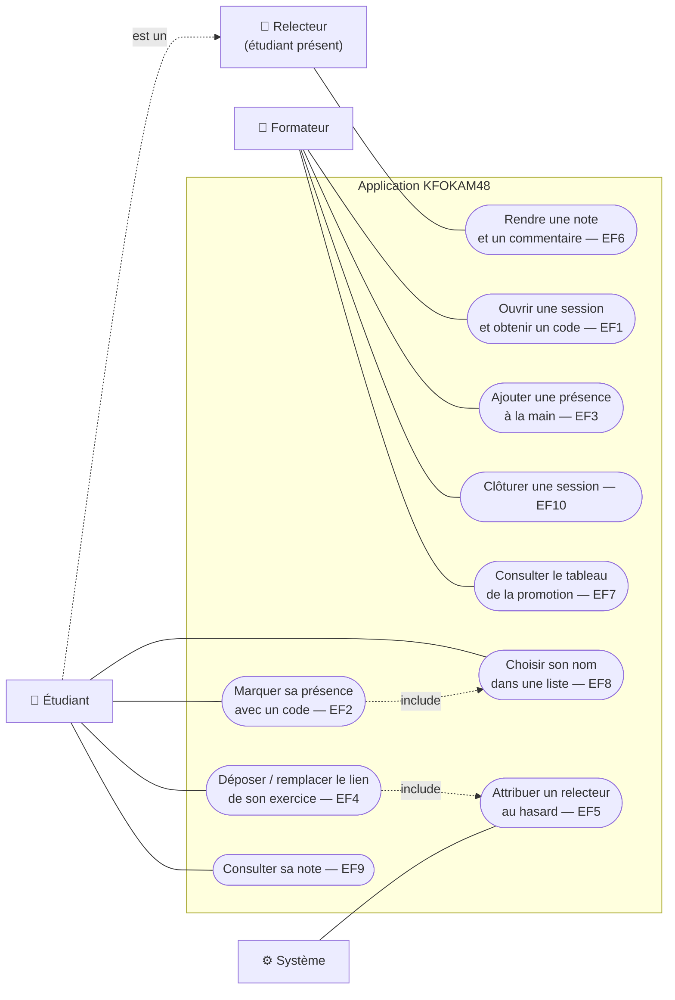

# D1 — Cas d'utilisation

Mermaid n'a pas de type « cas d'utilisation » : les acteurs sont à gauche, les cas d'utilisation (ovales) sont regroupés dans le cadre du système. Chaque cas renvoie à son exigence EFx du cahier des charges.

| Acteur | Cas d'utilisation | Règles principales |
|---|---|---|
| Formateur | EF1, EF3, EF7, EF10 | RG1, RG11, RG13, RG14 |
| Étudiant | EF2, EF4, EF8, EF9 | RG1, RG4, RG5, RG6, RG8, RG9, RG12 |
| Relecteur | EF6 | RG2, RG3, RG10 |
| Système | EF5 (déclenché par le dépôt EF4) | RG2, RG7 |

Il n'y a pas de cas « se connecter » : pas d'authentification (Q1).
