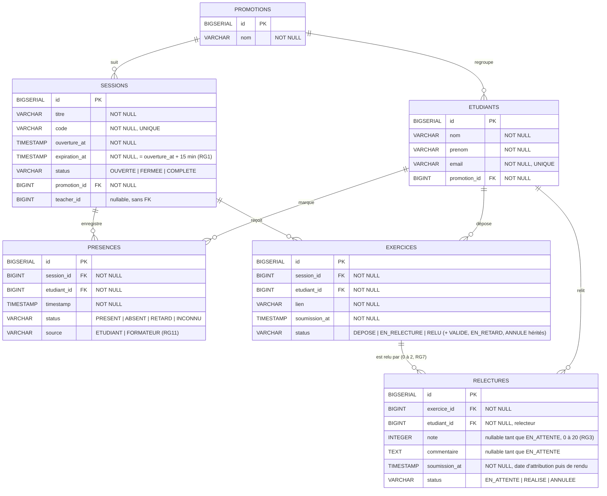

# D2 — Modèle de données

Le schéma est celui que produisent les migrations Flyway `V1` à `V6` (`backend/src/main/resources/db/migration/`). Toute évolution du schéma passe par une nouvelle migration **et** une mise à jour de ce diagramme dans le même commit.

## Contraintes d'intégrité et règles de gestion

| Contrainte | Table | Migration | Règle |
|---|---|---|---|
| `UNIQUE (session_id, etudiant_id)` | presences | V3 | RG5 : une présence par étudiant et par session |
| `CHECK source IN ('ETUDIANT','FORMATEUR')` | presences | V2 (colonne), V4 (check) | RG11 |
| `UNIQUE (session_id, etudiant_id)` | exercices | V4 | RG9 : un exercice par étudiant et par session (409) |
| ~~`UNIQUE (exercice_id)`~~ | relectures | V4, supprimée en V6 | Ancienne RG7 (un relecteur) |
| `UNIQUE (exercice_id, etudiant_id)` | relectures | V6 | RG7 : deux relecteurs **différents** ; le maximum de deux est appliqué par le service |
| `note` nullable, `CHECK note BETWEEN 0 AND 20` | relectures | V4 | RG3. La relecture est créée `EN_ATTENTE` sans note au dépôt (EF5) |

Règles qui ne peuvent pas être portées par le schéma, et qui sont donc appliquées dans les services et vérifiées par les tests :
- RG2 : le relecteur est différent de l'auteur de l'exercice ;
- RG1 et RG6 : expiration du code ;
- RG4 : blocage après 5 erreurs. Le compteur est gardé en mémoire dans l'API : c'est un état court (2 min) qui n'a pas besoin d'être persisté.

## Cardinalités

- Une promotion regroupe 0..n étudiants et 0..n sessions ; un étudiant et une session appartiennent à exactement une promotion.
- Une session enregistre 0..n présences, et un étudiant a au plus une présence par session.
- Un étudiant dépose au plus un exercice par session.
- Un exercice a 0 à 2 relectures, de relecteurs différents : moins de 2 tant qu'il n'y a pas assez de présents (RG13).
- Un étudiant peut avoir 0..n relectures à faire.
