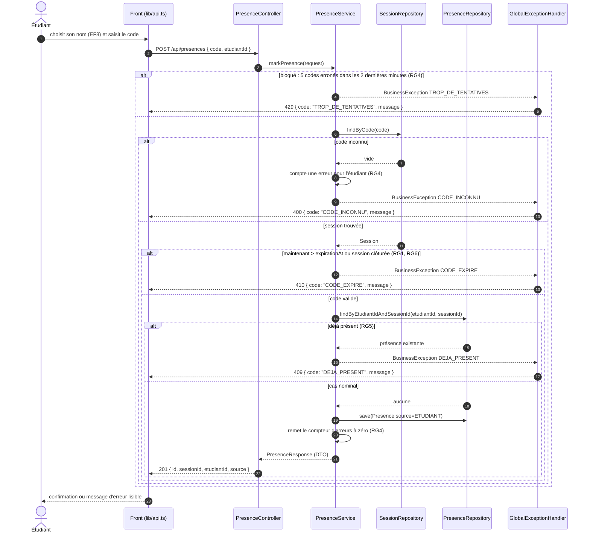

# D3 — Séquence : marquer sa présence

Opération `POST /api/presences { code, etudiantId }` du contrat. Les statuts et les codes d'erreur sont ceux de `api/contrat.yaml`. Toutes les erreurs passent par `GlobalExceptionHandler` et renvoient le format `{ code, message }`.

| Cas | Statut | Code d'erreur | Règle |
|---|---|---|---|
| Cas nominal | 201 | — | EF2 |
| Code inconnu | 400 | `CODE_INCONNU` | contrat, RG4 |
| Déjà présent | 409 | `DEJA_PRESENT` | RG5 |
| Code expiré ou session clôturée | 410 | `CODE_EXPIRE` | RG1, RG6 |
| Trop de tentatives | 429 | `TROP_DE_TENTATIVES` | RG4 (ajouté au contrat) |
