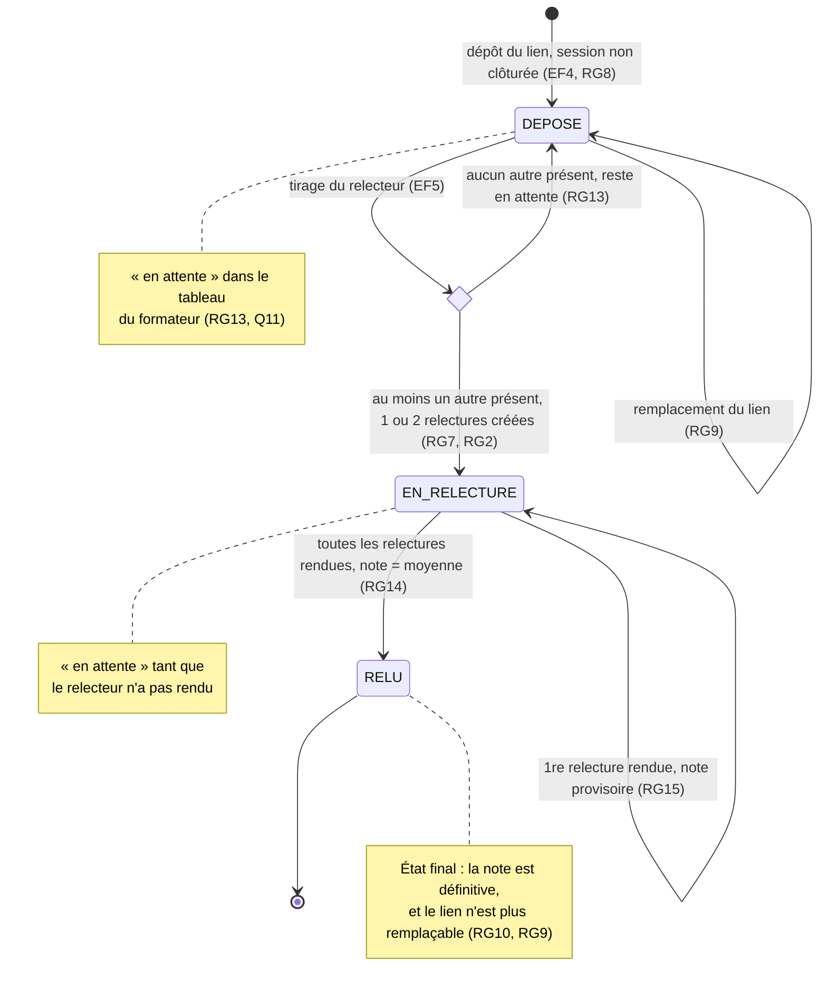

# D4 — États-transitions d'un exercice

Valeurs de `exercices.status` (migration V3). Les statuts `VALIDE`, `EN_RETARD` et `ANNULE` viennent de V1 : ils sont conservés en base mais ne sont jamais produits par l'application.

| Transition | Déclencheur | Refus possible |
|---|---|---|
| → DEPOSE | Dépôt d'un lien | 400 `LIEN_INVALIDE`, 409 `EXERCICE_DEJA_DEPOSE`, session clôturée |
| DEPOSE → EN_RELECTURE | Dépôt, si un autre étudiant est présent | — |
| DEPOSE ou EN_RELECTURE → lui-même | Remplacement du lien | — |
| EN_RELECTURE → EN_RELECTURE | Première des deux relectures rendue : note provisoire (RG15) | 400 `NOTE_INVALIDE` |
| EN_RELECTURE → RELU | Dernière relecture attribuée rendue : note = moyenne (RG14) | 400 `NOTE_INVALIDE`, 403 `AUTO_RELECTURE_INTERDITE` |
| Depuis RELU | Nouvelle relecture ou remplacement du lien | 409 `RELECTURE_DEJA_RENDUE`, 409 `EXERCICE_DEJA_RELU` |
